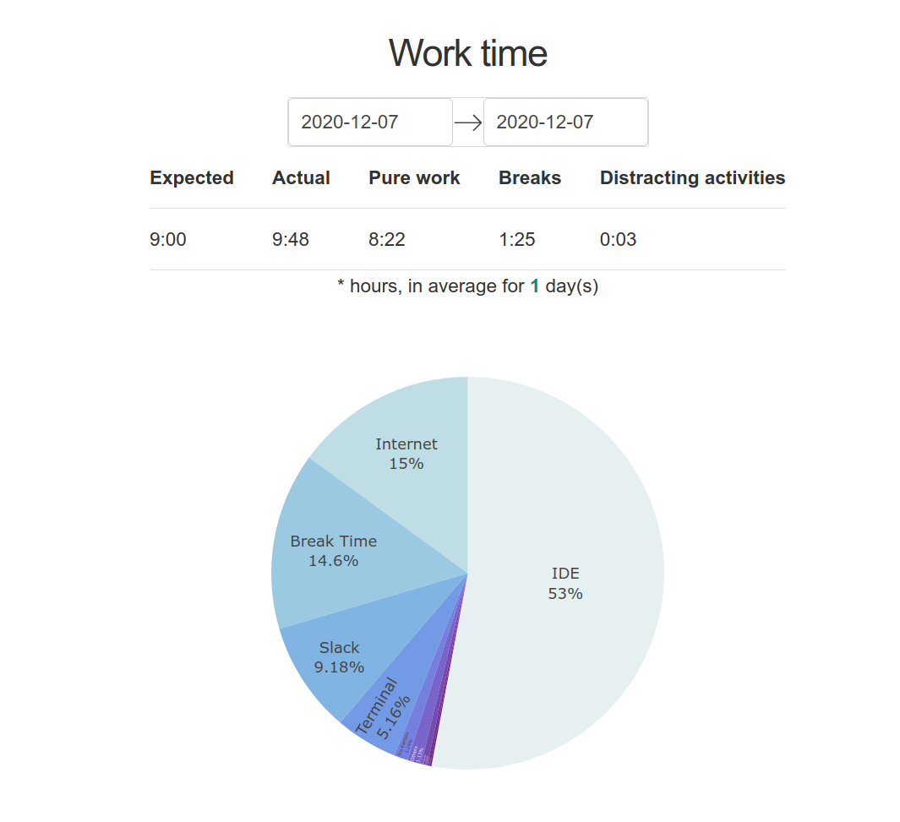
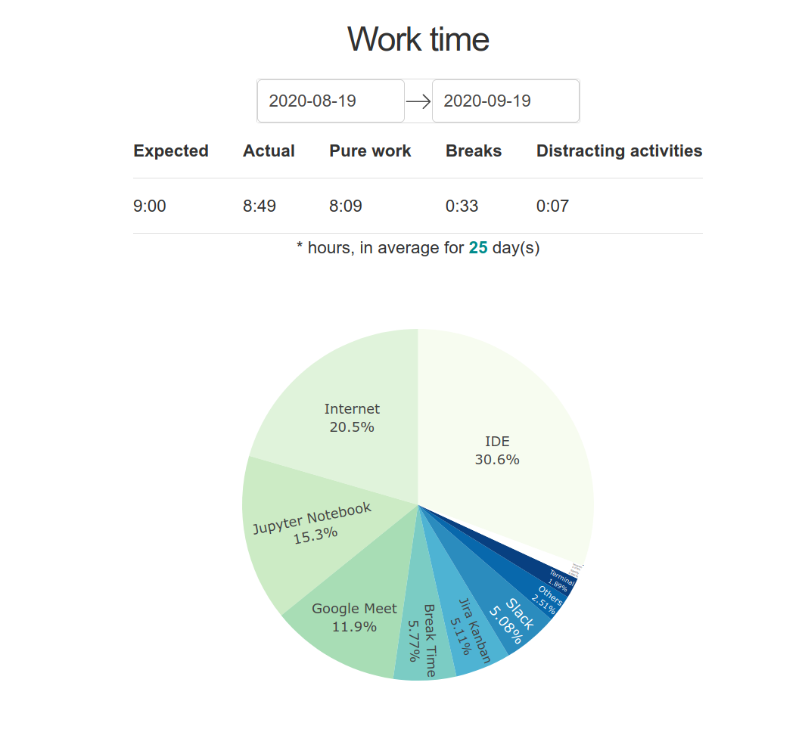

# Speaking Eye


[](https://codecov.io/gh/alena-bartosh/speaking-eye)

### 👀 Looking at

- [x] your working hours/breaks
- [x] activity in any apps (IDE, browser tabs, terminal, etc.)
- [x] distracting activity (custom list of apps/time limits)

### 📯 Speaking about

- [x] your activity on the computer  
  
  
- [x] overtime  
  
- [x] time to take a break  
  
- [x] distracting apps if you spend a lot of time there  
  

### 🌐 Speaks in

- [x] english
- [x] по-русски
- [x] українською

For other languages please feel free to make Pull Request :wink:

### Report examples

Using Speaking Eye you can simply track you working hours: 
   * during one day  
     
   * or as many days as you like  
          

### Installation

[Quick installation guide (video)](https://github.com/alena-bartosh/speaking-eye#quick-installation-guide)

The simplest way of installation is

```sh
pip install speaking-eye
```

Also you will need some system dependencies.

```sh
sudo apt-get install \
    python3-dev \
    python3-venv \
    libcairo2-dev \
    libgirepository1.0-dev \
    python3-gi \
    gir1.2-gtk-3.0 \
    gir1.2-wnck-3.0 \
    gir1.2-appindicator3-0.1 \
    gir1.2-notify-0.7
```

Please relogin to ensure `$PATH` env var contains ```~/.local/bin```.

Now you can run Speaking Eye with command line or using Applications Menu in your desktop environment.

```sh
$ speaking-eye
```

To install application for developing please see steps on [wiki pages](https://github.com/alena-bartosh/speaking-eye/wiki/Installation-for-dev).

### Auto start

Auto start is enabled by default. After first run Speaking Eye will copy its `.desktop` file into ```~/.local/config/autostart``` (or path from ```$XDG_CONFIG_HOME``` if set). Next time when you login application must start automatically.

To disable auto start please set it in config and rerun application. Speaking Eye will remove its file from autostart dir.

```
autostart: true  # change to false to disable
```

### Use
#### Basics

After successful installation and start, you will see a tray icon. A running Speaking Eye (**SE**) has two states: 
   * [active](https://github.com/alena-bartosh/speaking-eye/blob/master/src/speaking_eye/icon/light/active.png) (open; for working time);
   * [disabled](https://github.com/alena-bartosh/speaking-eye/blob/master/src/speaking_eye/icon/light/disabled.png) (crossed out; for free time).

Use the active SE to track your work. For this check the box *'Work Time'* in the context menu.
Eye is open: it thinks you are working. It will tell you about breaks, overtime and distracting activities. 
Use the computer as usual and show what you are capable of!

***Break*** in SE terminology — is ***a locked screen***. So when you get tired, just lock the screen for a while.
After finishing work at the end of the day, change the status to *disabled*. 
Eye is crossed out: it thinks you are not working. It will not talk to you, but will continue to collect information about your activity.

You also can close SE with *'Close'* in the context menu. Eye is closed: your browser activity is still tracked by ISP and Google. 🙃

#### Config

For a comfortable interaction with SE, please fill in [the config](https://github.com/alena-bartosh/speaking-eye/blob/master/src/speaking_eye/config/config.yaml). 
You can open it with *'Edit Config'* in the context menu.

Here you can choose the color theme of the icon and set time limits for notifications. 
Also choose which activity you want to track (it is necessary) and which apps are considered harmful or distracting (optional).

*'work_time_hours'* — is recommended to count with lunch. If *work_time* = 8 hours and *lunch* = 1 hour then it's better to set *work_time_hours: 9*. 

To track a specific group of applications, follow this pattern:

```
- Reading about my favorite project:        # save selected windows activity under this title
    wm_name: Chromium|Firefox|Opera         # x11 window manager names
    tab: speaking-eye                       # look only at a specific tab in the window

# E.g. let's open 3 links in 3 different browsers: 

# Chromium: https://github.com/alena-bartosh/speaking-eye/actions
# Firefox:  https://speaking-eye.ua/whats-new
# Opera:    https://www.google.com/search?q=speaking-eye

# In this case SE will save all these activities as 'Reading about my favorite project'
```
Config will be saved into ```~/.local/share/speaking-eye/config``` (or path from ```$XDG_DATA_HOME``` if set). 
[Additional config example.](https://github.com/alena-bartosh/speaking-eye/blob/master/src/speaking_eye/config/config_example.yaml)

#### Data

SE saves all collected data to ```~/.local/share/speaking-eye/data``` (or path from ```$XDG_DATA_HOME``` if set) into ```{date}_speaking_eye_raw_data.tsv``` files that contain
such columns for each activity:

```
start_time, end_time, activity_time, wm_class, window_name, is_work_time
```

You can open needed directory with *'Open Data'* in the context menu.

#### Reports

Reports are generated dynamically based on files with collected SE data and actual application groups in config.
For reports displaying Dash server is used. You can configure it in application config and open report page by clicking on *'Open Report'* in the context menu.

```
report_server:
  host: localhost
  port: 3838
  browser: firefox
```
***SE analyzes only work time (when eye is active and open)!***

### Quick installation guide

[](https://youtu.be/qz1N4jtmi9Q)

### Demo

[](https://youtu.be/0J-ZlpQaWHA)

### 🐌 Possible improvements

* Now SE uses ```xprop``` (a program that can list and set ```x11``` window properties). In the future we may want to use other window managers. Is it possible to get an active window using ```dbus```?
* Autogenerate config through GUI

### Code conduction

* Use [Gitmoji](https://gitmoji.carloscuesta.me) for commit messages

### Special thanks

* [@s373r](https://github.com/s373r) for mentoring and your love for me and strong typing
