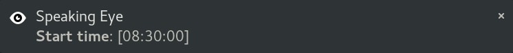
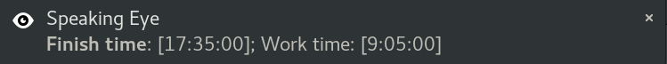
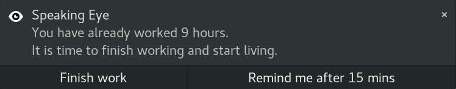
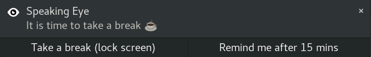
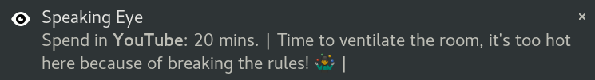

# Speaking Eye


[](https://codecov.io/gh/alena-bartosh/speaking-eye)

### :eyes: Looking at

- [x] your working hours/breaks
- [x] activity in any apps (IDE, browser tabs, terminal, etc.)
- [x] distracting activity (custom list of apps/time limits)

### :postal_horn: Speaking about

- [x] your activity on the computer  
  
  
- [x] overtime  
  
- [x] time to take a break  
  
- [x] distracting apps if you spend a lot of time there  
  

### :globe_with_meridians: Speaks in

- [x] english
- [x] по-русски
- [x] українською

For other languages please feel free to make Pull Request :wink:

### Installation and use

[Quick installation guide (video)](https://github.com/alena-bartosh/speaking-eye#quick-installation-guide)

1. [Install system dependencies](https://github.com/alena-bartosh/speaking-eye#system-dependencies)
2. [Install requirements](https://github.com/alena-bartosh/speaking-eye#setup)
3. [Set auto start](https://github.com/alena-bartosh/speaking-eye#set-auto-start)
4. [Manually run at first time](https://github.com/alena-bartosh/speaking-eye#one-time-start) or reboot the system

#### Basics

After successful installation and start, you will see a tray icon. A running Speaking Eye (**SE**) has two states: 
   * [active](https://github.com/alena-bartosh/speaking-eye/blob/master/icon/light/active.png) (open; for working time);
   * [disabled](https://github.com/alena-bartosh/speaking-eye/blob/master/icon/light/disabled.png) (crossed out; for free time).

Use the active SE to track your work. For this check the box *'Work Time'* in the context menu.
Eye is open: it thinks you are working. It will tell you about breaks, overtime and distracting activities. 
Use the computer as usual and show what you are capable of!

***Break*** in SE terminology — is ***a locked screen***. So when you get tired, just lock the screen for a while.
After finishing work at the end of the day, change the status to *disabled*. 
Eye is crossed out: it thinks you are not working. It will not talk to you, but will continue to collect information about your activity.

You also can close SE with *'Close'* in the context menu. Eye is closed: your browser activity is still tracked by ISP and Google. 🙃

#### Config

For a comfortable interaction with SE, please fill in [the config](https://github.com/alena-bartosh/speaking-eye/blob/master/config/config.yaml). 
Here you can choose the color theme of the icon and set time limits for notifications. 
Also choose which activity you want to track (set 'all' for all) and which apps are considered harmful or distracting ('none' if no such apps).

*'work_time_hours'* — is recommended to count with lunch. If *work_time* = 8 hours and *lunch* = 1 hour then it's better to set *work_time_hours: 9*. 

To track a specific group of applications, follow this pattern:

```
- Reading about my favorite project:        # save selected windows activity under this title
    wm_name: Chromium|Firefox|Opera         # x11 window manager names
    tab: speaking-eye                       # look only at a specific tab in the window

# E.g. let's open 3 links in 3 different browsers: 

# Chromium: https://github.com/alena-bartosh/speaking-eye/actions
# Firefox:  https://speaking-eye.ua/whats-new
# Opera:    https://www.google.com/search?q=speaking-eye

# In this case SE will save all these activities as 'Reading about my favorite project'
```

[Additional config example.](https://github.com/alena-bartosh/speaking-eye/blob/master/config/config_example.yaml)

#### Data

SE saves all collected data to ```speaking-eye/dest``` into ```{date}_speaking_eye_raw_data.tsv``` files that contain
such columns for each activity:

```
start_time, end_time, activity_time, wm_class, window_name, is_work_time
```

### System dependencies

```sh
sudo apt-get install \
    python3-dev \
    python3-venv \
    libcairo2-dev \
    libgirepository1.0-dev \
    python3-gi \
    gir1.2-gtk-3.0 \
    gir1.2-wnck-3.0 \
    gir1.2-appindicator3-0.1 \
    gir1.2-notify-0.7
```

### Setup
```sh
git clone https://github.com/alena-bartosh/speaking-eye.git && \
cd speaking-eye && \
make install
```

### Usage
```sh
SE_ARGS=--help make start
```

```
usage: speaking_eye.py [-h] [--log-level] [-c]

[speaking-eye] Track & analyze your computer activity

optional arguments:
  -h, --help      show this help message and exit
  --log-level     debug/info/warning/error
  -c , --config   config path
```

### One-time start
```sh
make start
```

### Set auto start
Speaking Eye will automatically turn on after system startup
```sh
make install/systemd
```

### Run type checking & linter & unittests
```sh
make checks
```

### Quick installation guide

[](https://youtu.be/x2HaQlQTiTM)

### Code conduction

* Use [Gitmoji](https://gitmoji.carloscuesta.me) for commit messages

### Special thanks

* [@s373r](https://github.com/s373r) for mentoring and your love for me and typing
